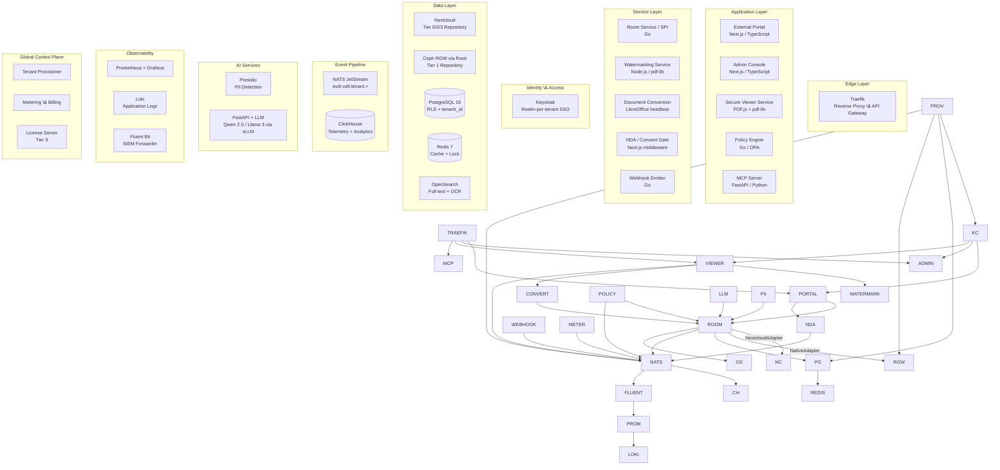
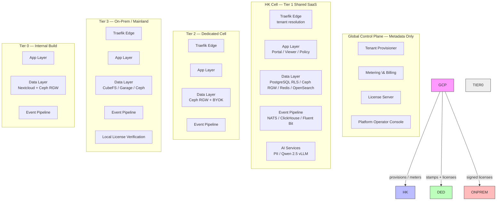
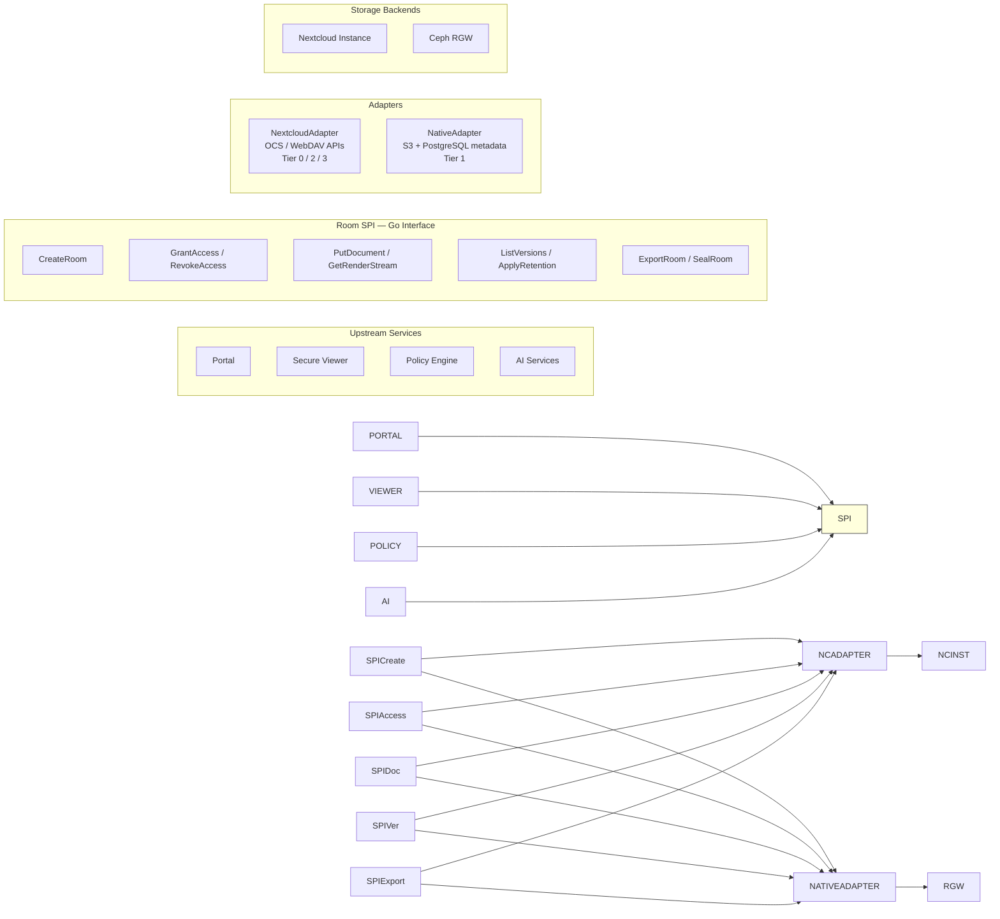
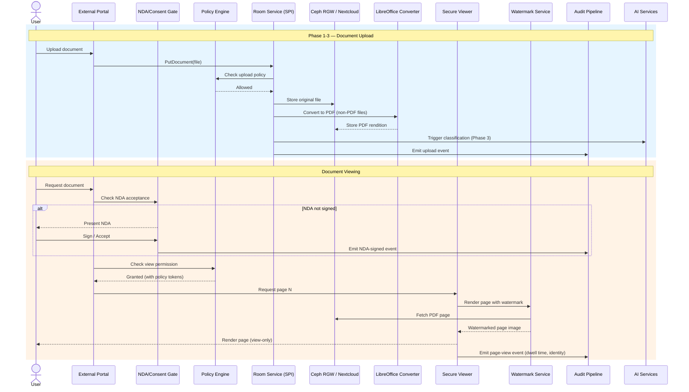
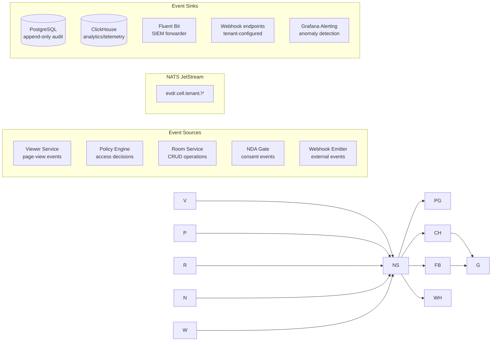
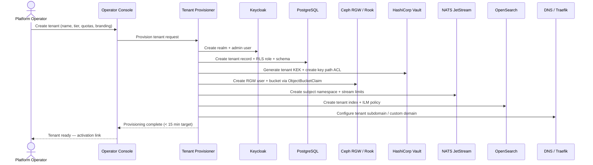
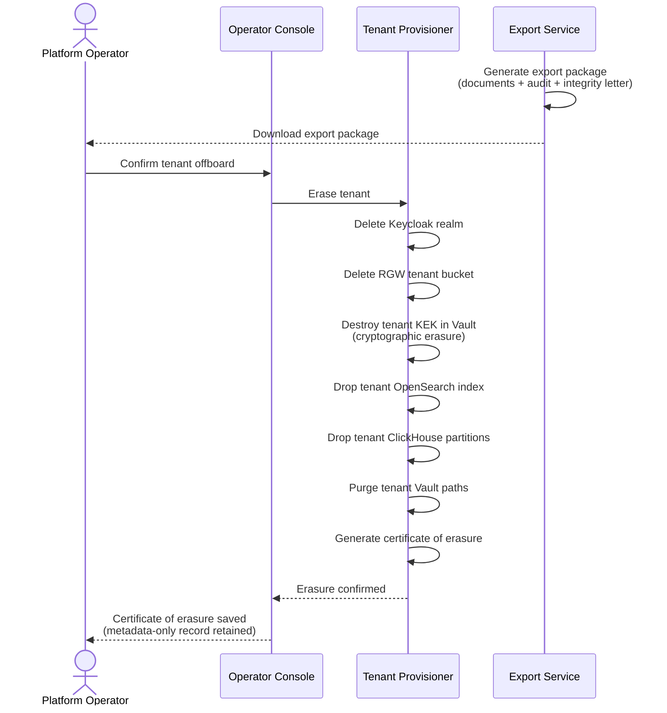
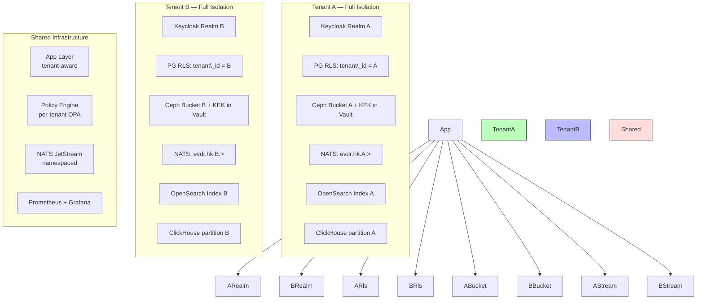
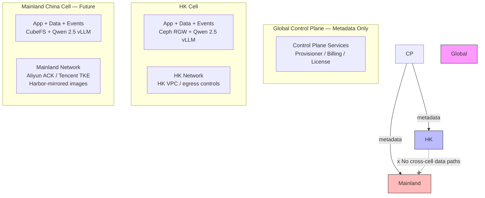

# EVDR — Functional and Technical Requirement Specifications (FTRS)

> \*\*Version 1.0\*\* | August 2026 | HSBC CTO Office
>
> Companion documents:
> - `Requirements/Ref/EVDR-Technology-Stack-Recommendation.md` v1.0 — single-tenant technology stack
> - `Requirements/Ref/EVDR-Multi-Tenant-Architecture-Addendum.md` v1.2 — multi-tenancy overlay \& control plane
> - `Requirements/Ref/EVDR-Object-Storage-Alternatives-Analysis.md` v1.2 — object storage decision (Ceph RGW)

\---

## 1\. Document Purpose and Scope

### 1.1 Purpose

This document defines the **complete functional and technical requirements** for EVDR (Enterprise Virtual Data Room) — a self-hosted, compliance-grade secure document exchange platform. It synthesises all prior research, competitive analysis, feature-blueprint work, architecture decisions, and technology-stack selections into a single authoritative specification.

### 1.2 Product Definition

EVDR is a **compliance-grade external collaboration room**: a self-hosted platform for exchanging internal documents safely with external entities (auditors, regulators, vendors, partners, investors), with governance controls, immutable audit trails, AI-assisted content intelligence, and optional privacy-preserving analytics. It is positioned between generic file-sharing tools (which lack compliance controls) and monolithic SaaS VDRs (which lack data sovereignty and extensibility).

### 1.3 Target Markets

|Market|Deployment tier|Data residency|Commercial model|
|-|-|-|-|
|HSBC internal (first build)|Tier 0 — self-hosted|HK on-prem / private cloud|Internal cost centre|
|HK/Asia-Pacific partners|Tier 1 — shared SaaS|HK cell only|Subscription + usage metering|
|Sovereignty-sensitive banks|Tier 2 — dedicated cell|HK cell, customer-managed keys|Enterprise license + SLA|
|Mainland China enterprises|Tier 3 — on-prem / mainland cell|Mainland China cell|Licensed, air-gap capable|

### 1.4 Scope Exclusions

* Real-time collaboration editing (Beyond v1 Office editing via Collabora)
* General-purpose file sync (this is not a Dropbox alternative)
* Email server / secure messaging
* Native clean-room analytics in Phase 1–4 (deferred to Phase 5)

### 1.5 Document Conventions

* **FR** = Functional Requirement (numbered sequentially)
* **TR** = Technical Requirement (numbered sequentially)
* **NFR** = Non-Functional Requirement (numbered sequentially)
* **SR** = Security Requirement (numbered sequentially)
* **\[MVP]** = Included in minimum viable product (end of Phase 2)
* **\[P1–P5]** = Build phase in which the requirement is delivered
* Priority: **Critical** (blocks MVP) / **High** (required for commercial launch) / **Medium** (differentiator) / **Low** (future/enhancement)

\---

## 2\. Stakeholders and User Personas

### 2.1 Primary Users

|Persona|Role|Key Needs|
|-|-|-|
|**Room Owner** (compliance officer / deal manager)|Creates and manages rooms, configures policies, monitors engagement|Branded rooms, granular permissions, audit export, engagement analytics|
|**Internal User** (bank employee)|Uploads, organises, and classifies documents|Secure upload, AI-assisted classification, PII redaction preview|
|**External Guest** (auditor / regulator / partner)|Accesses shared documents under governed conditions|Low-friction access (no install), view-only enforcement, clear NDA flow|
|**Platform Operator** (infrastructure / security team)|Manages the platform infrastructure and tenant lifecycle|Multi-tenant provisioning, monitoring, break-glass access, erasure|

### 2.2 Secondary Users

|Persona|Role|Key Needs|
|-|-|-|
|**System Administrator** (tenant-side)|Manages their organisation's users, policies, branding|SSO federation, policy templates, branding config, audit queries|
|**AI Agent / Workflow Orchestrator**|Programmatic room and document operations|MCP server, REST API, webhook events|

\---

## 3\. System Architecture Overview

### 3.1 High-Level Architecture

### 3.2 Multi-Tenant Deployment Model

### 3.3 Room SPI Architecture (Storage Abstraction)

\---

## 4\. Functional Requirements

### FR-1: Room Management

|ID|Requirement|Priority|Phase|
|-|-|-|-|
|FR-1.1|Create branded collaboration rooms with custom logo, colour theme, metadata, About page, and counterparty-specific branding|Critical|P1|
|FR-1.2|Configure room-level document permissions (view-only, download-allowed, print-allowed, edit-allowed) as distinct policy tiers|Critical|P1|
|FR-1.3|Set room-level watermark policy presets (density, opacity, rotation angle, token selection — viewer identity, timestamp, IP/domain, session ID)|Critical|P1|
|FR-1.4|Configure room-level expiration and auto-revocation schedules|High|P2|
|FR-1.5|Bulk permission templates for recurring exchange scenarios (regulator requests, vendor onboarding)|High|P2|
|FR-1.6|Legal-hold / room seal — freeze all documents and metadata from modification or deletion for eDiscovery|High|P2|
|FR-1.7|Full room export package: all documents + activity logs + SHA-256-backed integrity letter for evidentiary use|High|P2|
|FR-1.8|Room Q\&A workflow with threading, ownership assignment, and status tracking for external correspondence|Medium|P4|

### FR-2: Document Management

|ID|Requirement|Priority|Phase|
|-|-|-|-|
|FR-2.1|Upload documents (PDF, DOCX, XLSX, PPTX, images, scanned PDFs) with progress indication and size validation|Critical|P1|
|FR-2.2|Automatic document indexing and version tracking on upload|Critical|P1|
|FR-2.3|Folder hierarchy within rooms for logical document organisation|Critical|P1|
|FR-2.4|Drag-and-drop document upload with auto-indexing|High|P1|
|FR-2.5|Scalable large-file handling — support files up to multi-GB range|High|P4|
|FR-2.6|In-browser Office document editing with version history (Collabora Online integrated with repository)|Medium|P3|
|FR-2.7|Connectors to external repositories (SharePoint, OneDrive, Google Drive, on-prem file shares) for files to remain in-place while governance is unified centrally|Low|P5|

### FR-3: Secure Viewer and Document Protection

|ID|Requirement|Priority|Phase|
|-|-|-|-|
|FR-3.1|Page-streaming secure viewer — serve rendered pages individually to prevent full-document download|Critical|P1|
|FR-3.2|Server-rendered dynamic watermarking on every viewed page (viewer identity, timestamp, IP/domain, session ID) baked into rendered output before sending to browser|Critical|P1|
|FR-3.3|View-only enforcement: block download, print, copy/paste where technically feasible|Critical|P1|
|FR-3.4|Office-to-PDF conversion pipeline (LibreOffice headless) so the secure viewer normalises all formats to PDF for uniform rendering|Critical|P1|
|FR-3.5|Blur-on-focus-loss and keyboard-shortcut interception as screenshot-friction mechanisms|High|P2|
|FR-3.6|Per-room watermark density and opacity configuration|High|P1|
|FR-3.7|PPAD (post-download protection) — feasibility prototype for DRM wrapper or rights-enforced container as a bounded R\&D track|Low|P2 (stretch)|

### FR-4: Identity and Access Management

|ID|Requirement|Priority|Phase|
|-|-|-|-|
|FR-4.1|Internal user authentication via SSO (SAML 2.0 / OIDC) federated with enterprise IdP (AD/LDAP)|Critical|P1|
|FR-4.2|Multi-factor authentication (TOTP, WebAuthn/FIDO2) for internal users|Critical|P1|
|FR-4.3|External guest access via expiring secure links with password or one-time OTP — no account creation required|Critical|P1|
|FR-4.4|Time-bound and IP/domain-restricted access grants with instant revocation capability|Critical|P2|
|FR-4.5|RBAC roles (Room Owner, Room Contributor, Room Viewer, Auditor, System Administrator) with folder-/file-level granularity|Critical|P2|
|FR-4.6|ABAC policy conditions (time-of-day, device posture, geo-location) as extension to RBAC|High|P2|
|FR-4.7|Separate internal portal and external portal experiences — external entities never access internal systems directly|Critical|P1|
|FR-4.8|Keycloak realm-per-tenant for multi-tenant identity isolation — a person in multiple tenants receives separate principals and sessions|High|P2.5|

### FR-5: Governance and Policy Enforcement

|ID|Requirement|Priority|Phase|
|-|-|-|-|
|FR-5.1|NDA / e-signature gate enforced before first room or file access, with durable evidence retention (timestamp, IP, identity, document version)|High|P2|
|FR-5.2|Global baseline policies (platform non-negotiables: mandatory audit, watermarking, retention floors) enforced by the Policy Engine with no tenant override|Critical|P2|
|FR-5.3|Tenant-configurable policy overlays (IP allow-lists, download tiers, AI-processing consent, custom retention periods) managed via the Policy Engine|High|P2|
|FR-5.4|Data classification labels on documents with policy-driven access rules|High|P3|
|FR-5.5|Configurable retention and auto-purge schedules per document class|High|P3|

### FR-6: Upload and Inbound Exchange

|ID|Requirement|Priority|Phase|
|-|-|-|-|
|FR-6.1|Upload-only "File Drop" links for external parties to submit documents without seeing existing room content|Critical|P1|
|FR-6.2|File Drop links with configurable expiration, password protection, and upload-size limits|High|P2|
|FR-6.3|Automatic virus/malware scanning on uploaded files before acceptance into a room|High|P2|

### FR-7: Audit, Telemetry, and Compliance

|ID|Requirement|Priority|Phase|
|-|-|-|-|
|FR-7.1|Immutable, append-only audit log capturing every view, download, print, edit, policy decision, export, and admin action|Critical|P2|
|FR-7.2|Audit log pipeline forwarding structured events to SIEM infrastructure (Splunk, QRadar, Wazuh, Suricata)|Critical|P2|
|FR-7.3|Per-tenant audit export packages (ISO 27001 / SOC 2 evidence format)|High|P2|
|FR-7.4|Per-tenant SIEM forwarding — each tenant can configure their own SIEM destination|High|P3|
|FR-7.5|Page-level viewer telemetry: page-enter/page-exit events, dwell times, scroll depth per document per session|Medium|P4|
|FR-7.6|Room heatmaps and real-time open/view notifications for operational follow-up|Medium|P4|
|FR-7.7|Anomaly detection alerts for suspicious activity (mass downloads, unusual viewing hours, abnormal sharing patterns)|Medium|P4|
|FR-7.8|Compliance alignment: SOC 2 Type II and ISO 27001 control documentation and audit readiness for the SaaS cell|High|P4|

### FR-8: Content Intelligence and AI

|ID|Requirement|Priority|Phase|
|-|-|-|-|
|FR-8.1|OCR and full-text indexing across PDFs, Office files, and image-based documents|Medium|P3|
|FR-8.2|Automated PII/sensitive-data detection across 100+ data types (names, emails, IDs, financial data) before external release|High|P3|
|FR-8.3|Document redaction pipeline for PII masking with audit evidence of redactions applied|High|P3|
|FR-8.4|AI-assisted document classification and auto-routing into correct folders/categories on upload|Medium|P3|
|FR-8.5|AI summarisation of uploaded documents for quick room-level overview|Medium|P3|
|FR-8.6|AI translation for cross-border exchange scenarios (Chinese, English primary; additional languages as configured)|Medium|P3|
|FR-8.7|Per-tenant AI-processing consent switch — some tenants may contractually refuse AI processing of their documents; this must be enforceable before content reaches any model, with audit evidence of enforcement|High|P3|

### FR-9: Analytics and Engagement

|ID|Requirement|Priority|Phase|
|-|-|-|-|
|FR-9.1|Per-tenant analytics dashboard: room-level and document-level engagement metrics|Medium|P4|
|FR-9.2|Per-external-party interest summaries (which documents they viewed, time spent, download activity)|Medium|P4|
|FR-9.3|Leak-detection measures: canary tokens, invisible fingerprinting, or recipient-specific export signatures that trigger alerts when leaked copies surface|Medium|P4|
|FR-9.4|CRM and workflow integrations (Salesforce, HubSpot) via API and webhook|Low|P4|
|FR-9.5|Zapier/Make-style webhook compatibility for no-code downstream automation|Low|P4|

### FR-10: Integration and Extensibility

|ID|Requirement|Priority|Phase|
|-|-|-|-|
|FR-10.1|REST API for room CRUD, document management, permission administration, and audit queries|High|P3|
|FR-10.2|MCP server for agentic AI orchestration — programmatic room operations, document processing events, and audit log queries|High|P3|
|FR-10.3|Webhook event emitter for room lifecycle events (room opened, document viewed, NDA signed, export generated)|Medium|P4|
|FR-10.4|Email productivity integrations: Outlook Add-in and Gmail Extension to replace email attachments with governed secure links|Medium|P3|
|FR-10.5|Federated sharing protocol for organisations running their own EVDR instance|Low|P5|

### FR-11: Multi-Tenancy and Commercialisation

|ID|Requirement|Priority|Phase|
|-|-|-|-|
|FR-11.1|Automated tenant provisioning: Keycloak realm, database RLS role, storage bucket/user, NATS streams, search index, DNS, branding, quotas, feature flags — target < 15 minutes|High|P2.5|
|FR-11.2|Tenant Admin Console scoped per-tenant: rooms, users, policies, analytics, audit export, billing|High|P2.5|
|FR-11.3|Platform Operator Console: cell health, tenant lifecycle, quota management, break-glass access|High|P2.5|
|FR-11.4|Per-tenant metering: seats, storage GB, pages viewed, conversions, AI tokens, e-sign events|High|P2.5|
|FR-11.5|Billing integration: Stripe for SaaS card/SEPA billing; usage-CSV/API export for enterprise invoicing|High|P4|
|FR-11.6|License server for on-prem Tier 3: signed Ed25519 license files, node-locked or floating seats, offline activation, timed grace periods, air-gap capable|High|P4|
|FR-11.7|Tenant suspension: revoke all sessions, block edge access, preserve audit retention|High|P2.5|
|FR-11.8|Tenant offboarding with cryptographic erasure: export package → delete realm, bucket, KEK, index, partitions, Vault paths → certificate of erasure|High|P2.5|
|FR-11.9|Tenant tier upgrade (Tier 1 → 2): automated cell stamping + data migration with brief maintenance window|Medium|P4|
|FR-11.10|Per-tenant custom domain support (CNAME + dns-01 TLS automation)|Low|P4|

### FR-12: Optional Clean Room Analytics (Phase 5)

|ID|Requirement|Priority|Phase|
|-|-|-|-|
|FR-12.1|Privacy-preserving computation layer for collaborative analysis of structured datasets without raw-record exposure|Low|P5|
|FR-12.2|Governed query interface ensuring only aggregated or policy-approved outputs are released|Low|P5|
|FR-12.3|Separation of document rooms and analytic clean rooms at the control-model level|Low|P5|

\---

## 5\. Technical Requirements

### TR-1: Infrastructure and Orchestration

|ID|Requirement|Phase|
|-|-|-|
|TR-1.1|Container runtime: Docker + Kubernetes — K3s for single-node/small deployments, full K8s for scale|P0|
|TR-1.2|IaC: Terraform for infrastructure provisioning (VMs, networks, storage classes) + Helm charts for K8s service deployment; cloud-agnostic for multi-region future|P0|
|TR-1.3|CI/CD: GitLab CI with self-hosted runner; SAST (Semgrep/Trivy), DAST (OWASP ZAP), dependency scanning, SBOM generation from day one|P0|
|TR-1.4|Secrets management: HashiCorp Vault — dynamic secrets, encryption-as-a-service, PKI; strict per-tenant key-path ACLs; SOPS + age for lighter bootstrap if needed|P0|
|TR-1.5|Reverse proxy / API gateway: Traefik — native K8s integration, automatic TLS, circuit breaking, rate limiting, per-tenant tenant resolution middleware|P0|
|TR-1.6|Cell stamping: umbrella Helm chart with per-tier values files — one codebase stamps Tier 0–3 cells from the same artifact set|P2.5|

### TR-2: Repository and Storage

|ID|Requirement|Phase|
|-|-|-|
|TR-2.1|Room SPI: Go interface defining CreateRoom, GrantAccess, RevokeAccess, PutDocument, GetRenderStream, ListVersions, ApplyRetention, ExportRoom, SealRoom — all upstream services program against this interface, never against storage directly|P1|
|TR-2.2|NextcloudAdapter: wraps Nextcloud OCS/WebDAV APIs for Tier 0, 2, 3 deployments — one Nextcloud instance per cell/tenant|P1|
|TR-2.3|NativeAdapter: purpose-built on S3-compatible object store + PostgreSQL metadata + Redis for Tier 1 shared SaaS — no Nextcloud in the shared cell|P2.5|
|TR-2.4|SPI conformance suite: shared CI test suite run against both adapters on every merge — prevents feature drift between adapters|P1|
|TR-2.5|Object storage (all tiers): Ceph RGW via Rook operator — S3 API, SigV2+V4, versioning, lifecycle, bucket notifications|P0|
|TR-2.6|Object storage (on-prem appliance): Garage single-binary for single-box Tier 3 deployments where Ceph overhead is unjustified|P4|
|TR-2.7|Object storage (mainland China cell): CubeFS — CNCF-graduated, JD.com lineage, domestic production references|P5|
|TR-2.8|Envelope encryption (primary tenant-key control): per-document DEK wrapped by tenant KEK held in Vault — tenant isolation survives storage-cluster compromise|P2|
|TR-2.9|Server-side encryption (secondary): Ceph SSE-KMS with Vault KMS backend, tenant-scoped keys — bucket-per-tenant isolation|P2|
|TR-2.10|Per-tenant RGW user + bucket provisioned via Rook ObjectBucketClaims by the Tenant Provisioner|P2.5|
|TR-2.11|Database: PostgreSQL 16 — backing store for Nextcloud, custom policy engine, audit pipeline, room metadata, viewer telemetry; read replicas at scale|P0|
|TR-2.12|Caching and sessions: Redis 7 — Nextcloud file locking, application caching, session management, rate limiting|P0|
|TR-2.13|Nextcloud deployment: hardened TLS, backup strategy, baseline encryption controls, separate from external-facing services|P1|

### TR-3: External Portal and Admin Console

|ID|Requirement|Phase|
|-|-|-|
|TR-3.1|Frontend framework: Next.js 15 (React, App Router, TypeScript) — SSR for branded room pages, API routes for lightweight backend logic|P1|
|TR-3.2|UI component library: shadcn/ui + Tailwind CSS — owned components (copy-paste, not dependency); rapid per-room theming (brand colours, logos)|P1|
|TR-3.3|Client state: Zustand; server state: TanStack Query (React Query) against API gateway|P1|
|TR-3.4|Separate external portal (guest-facing) and admin console (tenant admin / platform operator) with distinct navigation and access models|P1|

### TR-4: Secure Viewer and Watermarking

|ID|Requirement|Phase|
|-|-|-|
|TR-4.1|Page-streaming viewer: custom service on PDF.js (Mozilla) — individual page rendering, not full-document serving|P1|
|TR-4.2|Server-side watermarking: pdf-lib (Node.js) or qpdf + Ghostscript for batch stamping — bakes viewer identity, timestamp, session tokens into rendered page images server-side (client-side overlays are strippable and therefore unacceptable)|P1|
|TR-4.3|Office-to-PDF conversion: LibreOffice headless (`soffice --headless --convert-to pdf`) — normalises DOCX/XLSX/PPTX to PDF for uniform secure-viewer rendering|P1|
|TR-4.4|Screenshot deterrence: browser-side JS (visibilitychange, blur events, keyboard-shortcut interception) + CSS mix-blend-mode overlays — deterrence layer only; watermarking is the forensic control|P2|
|TR-4.5|Conversion queue: per-tenant fair-shared worker pool with autoscaling — prevents large conversions from starving other tenants|P2.5|
|TR-4.6|Viewer watermark templates: tenant-configurable presets (density, opacity, rotation, token selection)|P1|

### TR-5: Policy and Compliance Engine

|ID|Requirement|Phase|
|-|-|-|
|TR-5.1|Policy microservice: Go (compiled binary, no runtime dependency, strong concurrency, crypto stdlib) — sits in front of Room SPI as the Policy Decision Point|P2|
|TR-5.2|Embedded OPA (Rego): global baseline policies (platform non-negotiables) + per-tenant policy overlays — every policy decision carries tenant\_id and is logged|P2|
|TR-5.3|NDA / consent gate: Next.js API middleware intercepting first room access, presenting NDA, persisting signed acceptance to audit store; e-signature integration via DocuSign/HelloSign/OpenSign iframe/webhook|P2|
|TR-5.4|Export package generator: full room export (documents + audit trail) with SHA-256-backed integrity letter for evidentiary handoff|P2|

### TR-6: Identity and SSO

|ID|Requirement|Phase|
|-|-|-|
|TR-6.1|Identity provider: Keycloak — SAML 2.0, OIDC, LDAP/AD federation, 2FA/TOTP, realm-per-tenant|P1|
|TR-6.2|Internal identity: Nextcloud connects to Keycloak as its SSO provider; enterprise AD/LDAP federated into Keycloak|P1|
|TR-6.3|External guest identity: lightweight OTP-based flows per Keycloak realm — no full Keycloak account required for guests|P1|
|TR-6.4|Platform operator identity: separate administrative realm in Keycloak; every operator action on a tenant realm is break-glass, audited, and alertable to the tenant's admins|P2.5|
|TR-6.5|Realm automation: Tenant Provisioner creates/manages Keycloak realms via Admin API — hundreds of realms supported|P2.5|

### TR-7: Event Bus and Audit Pipeline

|ID|Requirement|Phase|
|-|-|-|
|TR-7.1|Event bus: NATS JetStream — lightweight, high-throughput, persistent streaming with replay and at-least-once delivery; subject namespace `evdr.{cell}.{tenant}.>`; per-tenant stream size/age limits|P1|
|TR-7.2|Immutable audit store: PostgreSQL append-only table (tamper-evident, no UPDATE/DELETE permissions on audit rows)|P2|
|TR-7.3|Analytics store: ClickHouse — columnar, time-series-optimised, `tenant\_id` as leading partition key, per-tenant query quotas|P2|
|TR-7.4|SIEM forwarding: Fluent Bit sidecar in each pod → syslog or Elastic Agent → tenant-configurable SIEM destinations|P2|
|TR-7.5|Application log aggregation: Loki (Grafana stack) — cost-effective for log volumes without full-text indexing|P1|
|TR-7.6|All viewer actions, policy decisions, file accesses, and admin operations emit events to NATS with tenant\_id — no silent data paths|P2|

### TR-8: Search and AI Services

|ID|Requirement|Phase|
|-|-|-|
|TR-8.1|Full-text search: OpenSearch (Elasticsearch fork, fully open-source) — indexes all uploaded documents; index-per-tenant with ILM for isolation and clean erasure|P3|
|TR-8.2|OCR: Tesseract OCR — extracts text from scanned PDFs/images before OpenSearch indexing|P3|
|TR-8.3|PII detection: Presidio (Microsoft, open-source, Python) — named-entity recognition for PII with configurable detection rules and redaction capabilities|P3|
|TR-8.4|AI service: FastAPI microservice + LLM — self-hosted Qwen 2.5 via vLLM for Chinese/English capability; start with commercial API for speed, migrate to self-hosted for sovereignty|P3|
|TR-8.5|Embeddings: BGE-M3 (BAAI) — supports Chinese, English, and cross-lingual retrieval for semantic search|P3|
|TR-8.6|Per-tenant AI model routing: tenant can pin "no external AI" (self-hosted only) vs "external APIs allowed"|P3|
|TR-8.7|AI usage metering: token counts, pages OCR'd, documents summarised — per-tenant metered events|P3|

### TR-9: In-Browser Office Editing

|ID|Requirement|Phase|
|-|-|-|
|TR-9.1|Office editing: Collabora Online (CODE) — open-source LibreOffice-based editing in browser; Nextcloud native integration; DOCX/XLSX/PPTX with real-time collaboration and version history|P3|
|TR-9.2|Alternative fallback: ONLYOFFICE Document Server — if Collabora compatibility is insufficient for specific Excel/PowerPoint features; pick one, don't run both|P3|

### TR-10: API and Integration Layer

|ID|Requirement|Phase|
|-|-|-|
|TR-10.1|REST API: Next.js API routes (portal CRUD) + Go policy service (decision APIs)|P1|
|TR-10.2|MCP server: Python (FastAPI) implementing the MCP protocol — lets AI agents create rooms, upload documents, query audit logs, trigger workflows|P3|
|TR-10.3|Webhook emitter: custom Go service listening on NATS, emits events to configurable webhook URLs for downstream automation|P4|
|TR-10.4|Email add-ins: React-based Outlook Add-in + Gmail Extension — replace attachments with governed secure links|P3|

### TR-11: Monitoring and Observability

|ID|Requirement|Phase|
|-|-|-|
|TR-11.1|Infrastructure monitoring: Prometheus + Grafana — Node exporter, cAdvisor, custom service metrics; standard K8s stack|P1|
|TR-11.2|Alerting: Grafana Alerting + webhook → Slack/Email/Teams — alert on anomalies and threshold breaches|P1|
|TR-11.3|Viewer telemetry pipeline: custom PDF.js instrumentation → NATS → ClickHouse — page-enter/exit events, dwell times, scroll depth|P4|
|TR-11.4|Analytics dashboards: Grafana (ops) + product-grade React dashboards via Apache ECharts (tenant-facing engagement analytics)|P4|

### TR-12: Control Plane (Multi-Tenant Commercialisation)

|ID|Requirement|Phase|
|-|-|-|
|TR-12.1|Tenant Provisioner: idempotent onboarding engine — Keycloak realm, Postgres RLS role, Ceph RGW user/bucket (ObjectBucketClaim), Vault KEK, NATS subjects/streams, OpenSearch index, DNS/branding, quotas, feature flags|P2.5|
|TR-12.2|Tenant Config \& Feature Flags: DB-driven per-tenant settings, branding assets, watermark presets, retention policies, AI consent flags; self-hosted Flagsmith/Unleash if experimentation grows|P2.5|
|TR-12.3|Metering \& Billing: usage events from NATS → ClickHouse rollups → rating → invoice; Stripe for SaaS card/SEPA; usage-CSV export for enterprise invoicing|P2.5|
|TR-12.4|License Server (Tier 3): self-built verification in-product — Ed25519 signed license files, node-locked or floating seats, offline activation, timed grace periods; no phone-home required; air-gap capable|P4|

\---

## 6\. Security Requirements

### 6.1 Data Protection

|ID|Requirement|Phase|
|-|-|-|
|SR-1.1|Encryption at rest: AES-256 via envelope encryption (per-document DEK wrapped by tenant KEK in Vault) — primary tenant-key control|P2|
|SR-1.2|Encryption in transit: TLS 1.2/1.3 on all connections; internal service-to-service TLS via service mesh or Vault-issued certs|P0|
|SR-1.3|Server-side encryption: Ceph SSE-KMS with Vault KMS backend, tenant-scoped keys — secondary at-rest layer|P2|
|SR-1.4|Operator document access: cryptographically impossible without audited break-glass access to tenant KEK — platform operators cannot read tenant documents even with full infrastructure access|P2|
|SR-1.5|Break-glass model: operator KEK access is time-boxed, audit-logged, alertable to tenant admins, and requires multi-person approval|P2.5|
|SR-1.6|Key lifecycle: automatic KEK rotation per configurable schedule; DEK rotation on document re-upload; support for tenant-managed keys (BYOK) for Tier 2|P3|

### 6.2 Access Control

|ID|Requirement|Phase|
|-|-|-|
|SR-2.1|Tenant isolation: no cross-tenant data access at any layer — enforced by RLS (Postgres), bucket policy (Ceph), realm boundaries (Keycloak), stream namespaces (NATS), index scoping (OpenSearch), partition predicates (ClickHouse)|P2|
|SR-2.2|Row-Level Security: every business table includes `tenant\_id UUID NOT NULL`; all queries run under a tenant-scoped session variable with RLS policies; tenant context set by service at authentication time — never by client-supplied parameters|P2|
|SR-2.3|Privileged access: all admin and operator actions logged with actor identity, action, target, timestamp, IP, justification|P1|

### 6.3 Network Security

|ID|Requirement|Phase|
|-|-|-|
|SR-3.1|Network isolation: shared VPC for Tier 1 with egress controls; dedicated VPC per Tier 2 tenant; customer network for Tier 3|P0|
|SR-3.2|Edge security: per-tenant rate limits and quotas at Traefik — first noisy-neighbor control|P1|
|SR-3.3|Cell isolation: no cross-cell storage or database connectivity at the network layer — tenant data never leaves its cell|P2.5|

### 6.4 Application Security

|ID|Requirement|Phase|
|-|-|-|
|SR-4.1|CI/CD security: SAST, DAST, dependency scanning, SBOM generation on every build from Phase 0|P0|
|SR-4.2|Penetration testing: first pen test at end of Phase 2; annual pen tests thereafter; remediation SLA for critical findings|P2|
|SR-4.3|Threat model: documented threat model covering internal users, external parties, administrators, operators, and leak scenarios — updated per phase|P0|
|SR-4.4|Vulnerability management: Trivy container image scanning in CI; vulnerability alerting for base images; patch SLA|P0|

### 6.5 Audit and Evidence

|ID|Requirement|Phase|
|-|-|-|
|SR-5.1|Immutable audit trail: append-only Postgres table — no UPDATE/DELETE privileges on audit schema; tamper-evident by construction|P2|
|SR-5.2|Evidence generation: SHA-256 integrity hashes for room exports; cryptographic erasure certificates for tenant offboarding|P2|
|SR-5.3|SIEM integration: structured event forwarding to tenant-configured SIEM destinations|P2|

\---

## 7\. Data Flow Architecture

### 7.1 Document Upload and Viewing Flow

### 7.2 Audit Event Flow

### 7.3 Multi-Tenant Provisioning Flow

### 7.4 Tenant Erasure Flow

\---

## 8\. Multi-Tenancy Architecture

### 8.1 Tenant Isolation Model

### 8.2 Data Residency and Cell Architecture

\---

## 9\. Non-Functional Requirements

### NFR-1: Performance

|ID|Requirement|Target|
|-|-|-|
|NFR-1.1|Page-streaming viewer latency|< 500ms first-page render for documents < 50 pages|
|NFR-1.2|Document upload throughput|Support concurrent uploads from 50 users per tenant without degradation|
|NFR-1.3|Search query latency|< 2s for full-text search across tenant's indexed corpus (up to 1M documents)|
|NFR-1.4|API response time|P95 < 200ms for CRUD operations; P95 < 1s for complex audit queries|
|NFR-1.5|Office-to-PDF conversion|< 30s for documents < 100 pages; queued with per-tenant fair-share|
|NFR-1.6|Watermark rendering|< 300ms per page for server-side stamping|

### NFR-2: Scalability

|ID|Requirement|Target|
|-|-|-|
|NFR-2.1|Concurrent users|Support 500+ concurrent users per tenant; 5,000+ per SaaS cell|
|NFR-2.2|Storage capacity|Scale to PB-range per cell with Ceph replication/EC profiles|
|NFR-2.3|Tenant count|Support hundreds of tenants per SaaS cell; dedicated cells for heavy tenants|
|NFR-2.4|Horizontal scaling|Viewer service (most compute-intensive) scales horizontally; Ceph OSDs scale independently; Postgres read replicas for analytics queries|
|NFR-2.5|Tenant promotion|Heavy tenants promotable to dedicated Postgres/Ceph clusters via logical replication without code change|

### NFR-3: Availability

|ID|Requirement|Target|
|-|-|-|
|NFR-3.1|SaaS cell uptime|99.9% (Tier 1); 99.95% (Tier 2 dedicated)|
|NFR-3.2|RTO|< 4 hours for SaaS cell; < 1 hour for Tier 2|
|NFR-3.3|RPO|< 1 hour (Postgres WAL + Ceph replication); < 15 minutes for audit logs|
|NFR-3.4|Backup|Automated daily snapshots for Postgres and Ceph; cross-region replication optional for Tier 2|

### NFR-4: Reliability and Data Integrity

|ID|Requirement|Target|
|-|-|-|
|NFR-4.1|Audit immutability|Append-only with no UPDATE/DELETE; tamper-evident by schema design|
|NFR-4.2|Document integrity|SHA-256 hashes stored on upload; verification on retrieval; integrity letter on export|
|NFR-4.3|Conversion fidelity|LibreOffice conversion validated against original formatting; fallback to manual conversion for complex documents|

### NFR-5: Usability

|ID|Requirement|Target|
|-|-|-|
|NFR-5.1|Guest onboarding friction|External user from invitation link to viewing first document in < 3 clicks, < 60 seconds|
|NFR-5.2|Portal responsiveness|Mobile-responsive design; functional on tablet and desktop browsers|
|NFR-5.3|Admin self-service|Tenant admins can configure 80% of common operations without platform-operator involvement|
|NFR-5.4|Branding configuration|Non-technical room owners can configure branding (logo, colours, About page) without developer involvement|

### NFR-6: Localization and Internationalization

|ID|Requirement|Target|
|-|-|-|
|NFR-6.1|Primary languages|English and Chinese (Simplified + Traditional) for all user-facing interfaces|
|NFR-6.2|AI language support|Qwen 2.5 for Chinese/English classification, summarisation, and translation; additional languages configurable|
|NFR-6.3|Document OCR|Tesseract language packs for English, Chinese, and additional tenant-configured languages|

### NFR-7: Compliance

|ID|Requirement|Target|
|-|-|-|
|NFR-7.1|Data residency|Tenant data never leaves its designated cell (HK or mainland); enforced at network level|
|NFR-7.2|SOC 2 Type II|Audit controls and evidence generation aligned with SOC 2 Type II trust service criteria for the SaaS cell|
|NFR-7.3|ISO 27001|Information security management system aligned with ISO 27001 for the SaaS cell|
|NFR-7.4|PIPL compliance|Mainland China cell architecture (no cross-border data transfer, domestic infrastructure) satisfies PIPL requirements by construction|
|NFR-7.5|HKMA alignment|Data classification and retention policies aligned with HKMA regulatory expectations for regulated institutions|

\---

## 10\. Technology Stack Summary

### 10.1 Complete Stack by Layer

|Layer|Primary Technology|Language(s)|Phase|
|-|-|-|-|
|Infrastructure|K3s/Kubernetes, Terraform + Helm, Vault, Traefik, GitLab CI + Trivy + Semgrep + OWASP ZAP|HCL, YAML|P0|
|Repository Core|Nextcloud (Tiers 0/2/3), Ceph RGW via Rook (all tiers), PostgreSQL 16, Redis 7|PHP, C++, SQL|P0–P1|
|Room Abstraction|Room SPI (Go interface), NextcloudAdapter, NativeAdapter|Go|P1 / P2.5|
|External Portal|Next.js 15, shadcn/ui, Tailwind CSS, Zustand, TanStack Query|TypeScript|P1|
|Admin Console|Next.js 15 (tenant admin + operator console, separate apps)|TypeScript|P1 / P2.5|
|Secure Viewer|PDF.js, pdf-lib, LibreOffice headless|TypeScript, JS|P1|
|Policy Engine|Go microservice + embedded OPA (Rego)|Go, Rego|P2|
|Identity|Keycloak (realm-per-tenant SSO/SAML/OIDC/2FA)|Java|P1|
|Event Bus|NATS JetStream (per-tenant namespaces)|Go|P1|
|Audit Store|PostgreSQL (append-only RLS) + ClickHouse (analytics)|SQL|P2|
|Search \& OCR|OpenSearch (index-per-tenant) + Tesseract OCR|Java, C++|P3|
|PII Detection|Presidio (Microsoft, open-source)|Python|P3|
|AI Services|FastAPI + LLM (Qwen 2.5 / Llama 3 via vLLM), BGE-M3 embeddings|Python|P3|
|Office Editing|Collabora Online (CODE)|C++|P3|
|Monitoring|Prometheus + Grafana + Loki + Fluent Bit|Go, C|P1|
|API \& MCP|FastAPI MCP server, Next.js API routes, Go webhook emitter|Python, TypeScript, Go|P1–P4|
|Control Plane|Tenant Provisioner, Metering \& Billing (Stripe), License Server (Ed25519)|Go, Python|P2.5–P4|
|Clean Room (future)|PrivacyGo Data Clean Room (TEE), MP-SPDZ (MPC)|Python, C++|P5|

### 10.2 Storage Backend by Deployment Tier

|Tier|Storage Backend|Key Management|
|-|-|-|
|Tier 0 (Internal)|Ceph RGW via Rook (or Nextcloud primary storage)|Vault KEK + SSE-KMS/Vault|
|Tier 1 (Shared SaaS)|Ceph RGW via Rook — NativeAdapter|Per-tenant Vault KEK (envelope, primary) + SSE-KMS (secondary)|
|Tier 2 (Dedicated)|Ceph RGW via Rook — dedicated cluster|Customer-managed keys (BYOK) optional|
|Tier 3 (On-prem multi-node)|Ceph RGW via Rook|Customer KMS/HSM; platform KEK|
|Tier 3 (On-prem appliance)|Garage single-binary|Customer KMS; SSE-C only|

\---

## 11\. Build Phase Plan

### Phase 0 — Foundation and Control Plane (Weeks 1–3)

|Deliverable|Maps to|
|-|-|
|Threat model for all actor types and leak scenarios|SR-4.3|
|Data classification and retention policy model|FR-5.4, NFR-7.5|
|IaC baseline: Terraform + K3s + Vault + Traefik + GitLab CI|TR-1.1–TR-1.5|
|Room SPI interface contract drafted|TR-2.1|
|DRM strategy decision: view-first default, controlled export model|FR-3.7|
|CI/CD security pipeline: SAST, DAST, dependency scan, SBOM|SR-4.1|

### Phase 1 — Core Secure Exchange and Branded Rooms (Weeks 4–9) \[MVP starts]

|Deliverable|Maps to|
|-|-|
|Nextcloud deployment hardened (Postgres, Redis, TLS, backup)|TR-2.11–TR-2.13|
|Ceph RGW via Rook for object storage|TR-2.5|
|External-room portal with branding (logo, theme, metadata, About page)|FR-1.1, TR-3.1–TR-3.3|
|Secure guest access (expiring links, password/OTP, no-account)|FR-4.3, TR-6.3|
|File Drop for external upload-only submission|FR-6.1|
|Server-rendered dynamic watermarking (identity, timestamp, IP)|FR-3.2, TR-4.2|
|Page-streaming secure viewer (PDF.js, one page at a time)|FR-3.1, TR-4.1|
|Office-to-PDF conversion (LibreOffice headless)|FR-3.4, TR-4.3|
|Keycloak SSO for internal users; realm setup|FR-4.1–FR-4.2, TR-6.1–TR-6.2|
|NATS JetStream event bus; Loki + Prometheus + Grafana|TR-7.1, TR-7.5, TR-11.1–TR-11.2|
|Room SPI + NextcloudAdapter implementation|TR-2.1–TR-2.2, TR-2.4|

### Phase 2 — Governance, Audit, NDA, Evidentiary Export (Weeks 10–15) \[MVP ends]

|Deliverable|Maps to|
|-|-|
|Go policy engine + OPA baseline policies|TR-5.1–TR-5.2, FR-5.2|
|RBAC/ABAC layer (time-bound, IP/domain, revocation)|FR-4.4–FR-4.6, FR-5.3|
|Immutable audit log → SIEM pipeline|FR-7.1–FR-7.3, TR-7.2–TR-7.4|
|NDA/e-signature gate before first access|FR-5.1, TR-5.3|
|Export package + SHA-256 integrity letter|FR-1.7, TR-5.4|
|Envelope encryption (per-document DEK, tenant KEK)|SR-1.1, SR-1.4, TR-2.8|
|Ceph SSE-KMS with Vault backend|SR-1.3, TR-2.9|
|Viewer hardening (blur-on-focus-loss, shortcut interception)|FR-3.5, TR-4.4|
|First security audit and penetration test|SR-4.2|
|PostgreSQL RLS with tenant\_id on all tables|SR-2.2, TR-2.11|
|Break-glass operator access model|SR-1.5|

### Phase 2.5 — Commercialisation Track (Weeks 16–20, parallel with Phase 3)

|Deliverable|Maps to|
|-|-|
|NativeAdapter build + SPI conformance parity|TR-2.3–TR-2.4|
|Tenant Provisioner (< 15 min onboarding)|FR-11.1, TR-12.1|
|Keycloak realm automation|TR-6.4–TR-6.5|
|Tenant Admin Console + Platform Operator Console split|FR-11.2–FR-11.3|
|Metering pipeline (seats, storage, pages, AI tokens)|FR-11.4, TR-12.3|
|Cell stamping model (umbrella Helm chart, per-tier values)|TR-1.6|
|Pilot: 2–3 internal business units as real tenants|FR-11.1|
|Tenant suspension and offboarding flows|FR-11.7–FR-11.8|

### Phase 3 — Intelligence, Editing, Workflow Integration (Weeks 16–22)

|Deliverable|Maps to|
|-|-|
|OCR + full-text indexing (OpenSearch + Tesseract)|FR-8.1, TR-8.1–TR-8.2|
|PII detection and redaction pipeline (Presidio)|FR-8.2–FR-8.3, TR-8.3|
|AI classification, summarisation, translation (FastAPI + vLLM)|FR-8.4–FR-8.6, TR-8.4–TR-8.5|
|Per-tenant AI consent switch and metering|FR-8.7, TR-8.6–TR-8.7|
|In-browser Office editing (Collabora Online)|FR-2.6, TR-9.1|
|Email add-ins (Outlook + Gmail)|FR-10.4, TR-10.4|
|REST API + MCP server|FR-10.1–FR-10.2, TR-10.1–TR-10.2|
|Data classification labels and policy-driven rules|FR-5.4–FR-5.5|
|Per-tenant SIEM forwarding|FR-7.4|

### Phase 4 — Analytics, Leak Detection, Business Integrations (Weeks 23–26)

|Deliverable|Maps to|
|-|-|
|Page-level engagement analytics + heatmaps|FR-7.5–FR-7.6, FR-9.1–FR-9.2, TR-11.3–TR-11.4|
|Leak detection (canary tokens, fingerprinting)|FR-9.3|
|Anomaly detection alerts|FR-7.7|
|CRM integrations (Salesforce, HubSpot) + Zapier webhooks|FR-9.4–FR-9.5, FR-10.3, TR-10.3|
|Billing GA (Stripe) + license server for Tier 3|FR-11.5–FR-11.6, TR-12.3–TR-12.4|
|SOC 2 Type I complete; Type II in progress|NFR-7.2|
|Large-file handling (multi-GB)|FR-2.5|
|Per-tenant custom domain (CNAME + dns-01)|FR-11.10|
|Tenant tier upgrade automation (1 → 2)|FR-11.9|

### Phase 5 — Optional Privacy-Preserving Analytics (Weeks 27+)

|Deliverable|Maps to|
|-|-|
|PrivacyGo Data Clean Room evaluation (TEE-based collaboration)|FR-12.1|
|MP-SPDZ secure multi-party computation prototype|FR-12.1|
|Governed query interface (aggregated outputs only)|FR-12.2|
|Document rooms vs analytic clean rooms separation|FR-12.3|
|Mainland China cell evaluation (CubeFS, domestic K8s, PIPL)|NFR-7.4, TR-2.7|

\---

## 12\. Team and Skills

|Role|Primary Skills|Phase|
|-|-|-|
|Platform / Backend Engineer|Go, PostgreSQL, Kubernetes, Terraform, NATS|P0–P4|
|Frontend / Product Engineer|TypeScript, React/Next.js, Tailwind, PDF.js|P0–P4|
|Infrastructure / Security Engineer|Docker/K8s, Vault, CI/CD security, Traefik, Ceph/Rook|P0–P4|
|AI/ML Engineer (Phase 3+)|Python, FastAPI, LLM/ML, vLLM|P3–P4|
|Cryptography / Privacy Engineer (Phase 5)|MPC, TEE, privacy computing|P5|

\---

## 13\. Commercial Launch Gate Criteria

The following criteria must be met before external commercial launch (end of Phase 4):

1. NativeAdapter conformance parity with NextcloudAdapter verified by CI suite
2. Penetration test of the shared SaaS cell passed with no critical findings
3. SOC 2 Type I audit complete; Type II observation period in progress
4. Tenant onboarding demonstrated in < 15 minutes across ≥ 10 test tenants
5. Billing cycle executed end-to-end (Stripe + usage metering)
6. Break-glass transparency features demonstrated to ≥ 2 prospect security teams
7. Per-tenant SIEM forwarding operational for ≥ 3 tenant-configured destinations
8. AI consent switch enforced with audit evidence for ≥ 2 tenant configurations

\---

## 14\. Open Decisions

|#|Decision|Status|Due|
|-|-|-|-|
|1|Custom domains (CNAME + dns-01) at commercial launch vs Phase 4+|Open|Phase 3 review|
|2|Vault Enterprise namespaces vs OSS path-prefix ACLs (decide at \~50 tenants or first BYOK deal)|Open|Phase 2.5|
|3|OPA vs AWS Cedar for policy overlay language|Open|Phase 2.5 spike|
|4|Self-built license verification vs Keygen-style server for Tier 3|Open|Phase 2.5 spike|
|5|Mainland China cell trigger criteria (committed pipeline? entity readiness?)|Open|Business decision; tech readiness checklist attached|
|6|Collabora vs ONLYOFFICE — pick one for production (evaluated in Phase 3)|Open|Phase 3 start|
|7|Zitadel vs Keycloak if realm automation proves painful at scale|Deferred|Review at >100 tenants|
|8|Garage v3 for appliance tier — re-evaluate if versioning + SSE-KMS are added|Deferred|Phase 4 review|

